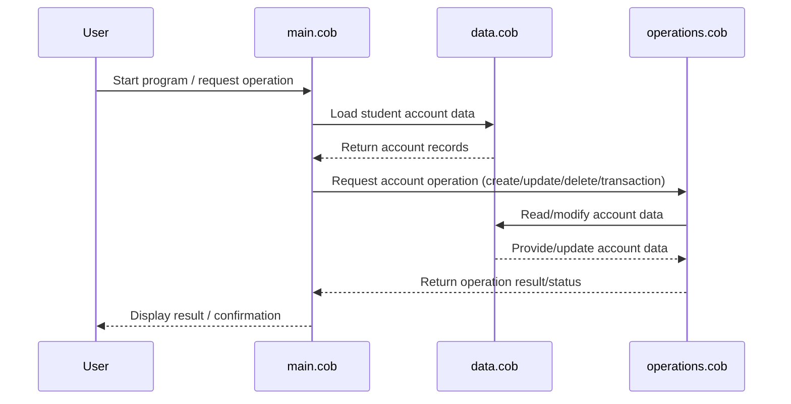

# COBOL Source Code Documentation

This project contains legacy COBOL code for managing student accounts. Below is an overview of each COBOL file, their key functions, and business rules implemented in the system.

## File Overview

### `main.cob`

**Purpose:**

- Serves as the program entry point.
- Handles the main control flow for student account operations.

**Key Functions:**

- Initializes the program and environment.
- Calls procedures for reading data, performing operations, and outputting results.

**Business Rules:**

- Ensures the correct sequence of operations for student account processing.
- Handles user input and program termination.

---

### `data.cob`

**Purpose:**

- Defines the data structures and storage for student accounts.

**Key Functions:**

- Declares student account records, including fields such as student ID, name, balance, and status.
- Provides data definitions used by other modules.

**Business Rules:**

- Enforces data integrity by specifying valid data types and field lengths.
- May include validation rules for account fields (e.g., valid ID formats, non-negative balances).

---

### `operations.cob`

**Purpose:**

- Implements the core business logic for student account management.

**Key Functions:**

- Functions for creating, updating, and deleting student accounts.
- Handles transactions such as deposits, withdrawals, and balance inquiries.
- Performs calculations and updates to account balances.

**Business Rules:**

- Prevents overdrafts and ensures sufficient funds for withdrawals.
- Enforces rules for account creation (e.g., unique student IDs).
- Applies business logic for transaction limits and account status changes.

---

## Business Rules Summary

- Student accounts must have unique IDs.
- Balances cannot be negative.
- Withdrawals are only allowed if sufficient funds are available.
- All operations are logged and validated for data integrity.

For further details, refer to the source code in the `/src/cobol/` directory.

---

## Sequence Diagram: Student Account Data Flow

